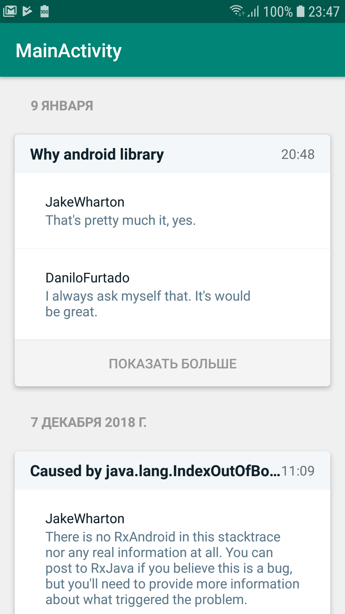

# units-test-task

  

Внимание. Для работы приложения нужен github token https://github.com/settings/tokens. В приложении положить его нужно в класс Constants.java в поле TOKEN

Тестовое задание выполнено в 2х реализация.
 - [#Paging](https://github.com/R00We/units-test-task/tree/paging) с использованием библиотеки paging и отложенной подгрузкой комментариев
 - [#Master](https://github.com/R00We/units-test-task/tree/master) с самописной реализацией endless scrolling и предзагрузкой комментариев по средствам rx
 
 
